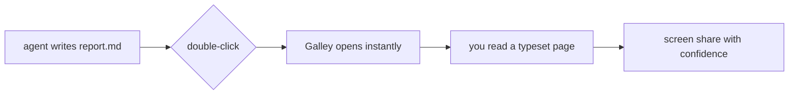
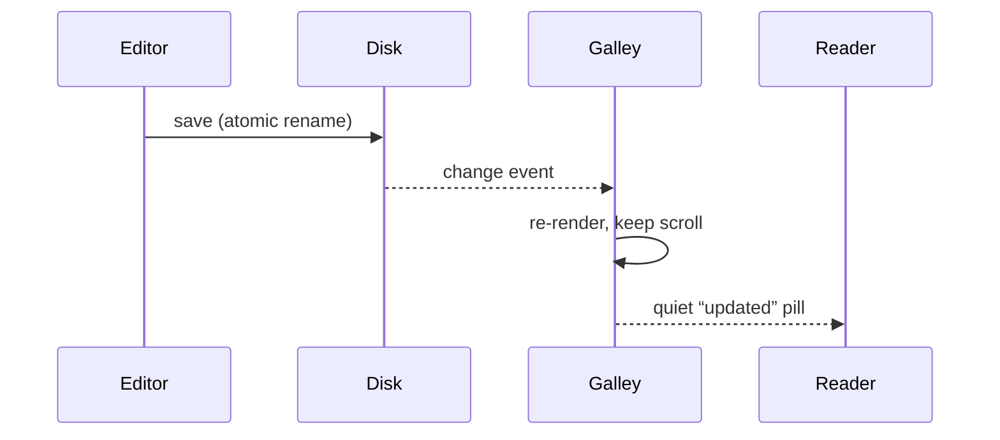

# Everything Markdown can do, typeset

This document exercises every rendering path in Galley. If you're evaluating
the app, this page *is* the pitch: **bold**, *italic*, ***both***, `inline code`,
~~strikethrough~~, [links](https://thesis.do), and smart typography --- quotes,
dashes, ellipses...

## Structure

Headings establish rhythm. Second-level headings carry a hairline; the smallest
level becomes a mono eyebrow, like a section marker in a journal.

### Lists

- Unordered, with muted markers
- Items hold `code`, **bold**, and [links](https://thesis.do)
  - And nest cleanly
- Without crowding the page

1. Ordered lists count themselves
2. And keep their alignment
3. However long they grow

### Task lists

- [x] Parse the manuscript
- [x] Typeset the proof
- [ ] Send to the reader
- [ ] Print run

###### colophon

## Quotes and callouts

> The best software doesn't ask for your attention. It gives it back.

> [!note]
> Galley renders GitHub-style alerts — note, tip, important, warning, caution —
> as quiet cards with a spectral accent.

> [!warning]
> This one is a warning. Agents love emitting these; now they look intentional.

## Code

```swift
struct Galley {
    let role = "reader"

    /// A reader never mutates the manuscript.
    func open(_ file: URL) -> Page {
        Page(typeset: file, cursor: nil)
    }
}
```

```python
def reading_time(words: int, wpm: int = 225) -> int:
    """Minutes, rounded up, never zero."""
    return max(1, round(words / wpm))
```

Hover any block for a copy button. The palette is the brand's spectral family,
tuned separately for Paper and Ink.

## Tables

| Surface | Hex | Role |
| --- | --- | --- |
| Cream | `#F1ECE2` | The page |
| Cream, raised | `#F8F5EE` | Cards and code |
| Ink | `#15140E` | Text |
| Muted | `#8E8879` | Whispers |

## Diagrams





## Mathematics

Inline math sits in the line: $e^{i\pi} + 1 = 0$. Display math gets room to breathe:

$$
\nabla \cdot \mathbf{E} = \frac{\rho}{\varepsilon_0}
\qquad
\oint \mathbf{B} \cdot d\boldsymbol{\ell} = \mu_0 I_{\text{enc}}
$$

## Footnotes and rules

Footnotes tuck themselves below the fold[^1], numbered in mono[^2].

A horizontal rule is the one place the full spectral gradient appears:

---

## The live part

Open a file an agent is still writing. Galley watches the disk, re-renders on
every save, and — if you're already at the bottom — follows the tail as new
content streams in. A small **updated** pill is the only announcement.

Check the Info popover (`ⓘ`) for words, reading time, and an approximate token
count, because in 2026 you think about context windows more than page counts.

[^1]: Set smaller, in the secondary ink, under a short hairline.
[^2]: No horizon-wide divider. Just enough.
