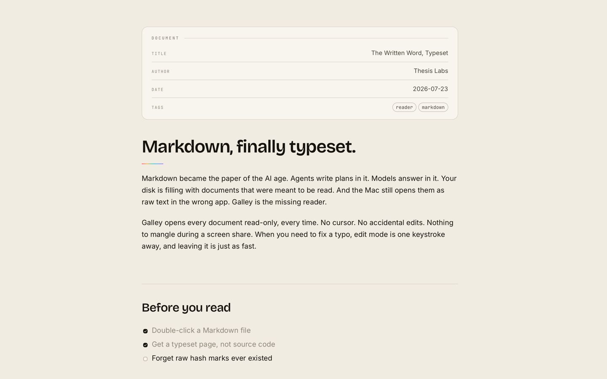
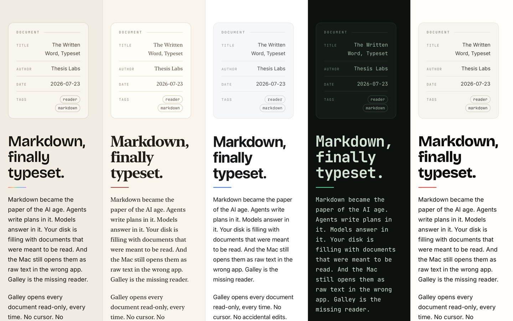

# Galley

**A quiet, beautiful reader for Markdown. The missing system app for the Mac.**



Galley turns any `.md` file into a typeset page the moment you double-click it.
It will never, ever edit one. In publishing, a *galley* is the read-only,
typeset proof of a manuscript sent to readers before printing. That's this app.

An open-source macOS app from [Thesis Labs](https://thesis.do).

## Install

Download the latest build from [Releases](https://github.com/JessieSalas/galley/releases),
unzip it, and drag Galley to Applications. It's an unsigned preview build for
now, so right-click and choose Open the first time.

Or build it from source, see Building below.

App Store: coming soon.

## Why it exists

Markdown became the paper of the AI age. Every LLM emits it; coding agents use
it as working memory (`CLAUDE.md`, `plan.md`, `report.md`); the web is being
re-served in it for agents. Disks are filling with Markdown written by machines
for humans to read, and macOS still opens `.md` as raw hash marks in TextEdit,
or a 10-second Xcode launch, or an *editor* with a blinking cursor in a file you
only wanted to read.

Every incumbent monetizes writing, so reading is a degraded side-mode. Galley is
the opposite bet: **read-only is the entire product.**

- **It opens instantly and renders everything.** GFM tables, task lists,
  footnotes, GitHub callouts, syntax-highlighted code, Mermaid diagrams, KaTeX
  math, YAML front matter as a tidy metadata card.
- **It keeps up with your AI.** Galley watches the open file and re-renders as
  an agent writes it, keeping your scroll position, following the tail if
  you're at the bottom, announcing itself with nothing but a quiet pill.
- **It's screen-share-proof.** No caret, no edit mode, no spellcheck squiggles,
  no chance of mangling a document in front of an audience. `⌘⇧P` for a
  full-screen presentation view.
- **It's a real Mac citizen.** Document-based, sandboxed, Quick Look extension
  for Space-bar previews, Open Recent, per-document scroll memory, PDF/HTML
  export, print that actually looks right.
- **Five real themes, each with light and dark.** Thesis (warm paper and ink),
  Manuscript (bookish serif), Studio (clean neutral), Terminal (all mono), and
  Editorial (high-contrast headline red), plus per-theme customization of
  fonts, heading weight, colors, and the spectral accents (on by default only
  in Thesis; toggleable everywhere).

  

- **Editing is a mode, not a default.** Every document opens read-only, every
  time. When you need to fix a typo, `⌘⇧E` enters a deliberate source-editing
  mode with syntax-highlighted Markdown, undo, find, and explicit `⌘S` save.
  Unsaved changes are guarded on close. There is never a cursor waiting to
  happen.
- **It refuses the rest.** No vault, no account, no sync, no subscription,
  no telemetry. Free and MIT-licensed.

## The design

Galley wears the Thesis Labs system: warm cream paper and near-black ink in
both directions (**Paper** and **Ink** themes), Bricolage Grotesque display
type, Inter body, JetBrains Mono for code, hairline rules, and one spectral
gradient used in exactly three places. Syntax highlighting uses the same
spectral palette, so code looks like the brand. See [DESIGN.md](DESIGN.md) for
the full document.

## Building

Requires Xcode 16+ (built against Xcode 26) and [XcodeGen](https://github.com/yonaskolb/XcodeGen):

```bash
brew install xcodegen
xcodegen generate
xcodebuild -project Galley.xcodeproj -scheme Galley -configuration Release build
```

Web assets (`Galley/Resources/web`) are prebuilt and committed, so plain
`xcodebuild` works with no Node installed. To rebuild them after changing
`web/src`:

```bash
cd web && ./build.sh
```

## Making Galley your default Markdown app

Select any `.md` file in Finder → `⌘I` → *Open with* → **Galley** → **Change All**.
(Sandboxed apps can't change this for you programmatically; Galley won't hijack
file types behind your back either. It registers as an *alternate* handler.)

## Keyboard

| Key | Action |
| --- | --- |
| `⌘⇧E` | Edit Markdown (and back) |
| `⌘S` | Save (while editing) |
| `⌘F` / `⌘G` / `⌘⇧G` | Find, find next, find previous |
| `⌃⌘S` | Toggle outline sidebar |
| `⌘=` / `⌘−` / `⌘0` | Zoom |
| `⌘⇧P` | Presentation mode |
| `⌘R` | Reload from disk |
| `⌥⌘E` / `⌥⌘⇧E` | Export PDF / HTML |
| `⌘⇧C` | Copy Markdown source |
| `⌥⌘⇧C` | Copy for AI (source + file path header) |
| Space | Page down |

## Repository layout

```
Galley/            SwiftUI app (App, Views, Core, Resources)
QuickLook/         Quick Look preview extension (markdown-it in JavaScriptCore)
web/               Source for the rendering pipeline (esbuild → committed bundles)
scripts/           Icon generator, DMG packaging
docs/              Distribution guide, App Store metadata
DESIGN.md          The founding design document
```

## Roadmap

Folder browsing with relative-link navigation · chat-transcript rendering ·
custom CSS themes · localizations. See [DESIGN.md](DESIGN.md).

## License

[MIT](LICENSE) © 2026 Thesis Labs.
Bundled libraries (markdown-it, highlight.js, mermaid, KaTeX, js-yaml, fonts)
are MIT/BSD/OFL. See [ACKNOWLEDGEMENTS.md](ACKNOWLEDGEMENTS.md) for details.
