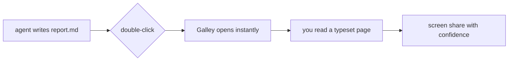

# Diagrams and tables, rendered

Point Galley at a file your agent is still writing, and it follows along
quietly.

Tables read like tables, not pipes and dashes.

| Surface | Hex | Role |
| --- | --- | --- |
| Cream | `#F1ECE2` | The page |
| Cream, raised | `#F8F5EE` | Cards and code |
| Ink | `#15140E` | Text |
| Muted | `#8E8879` | Whispers |
